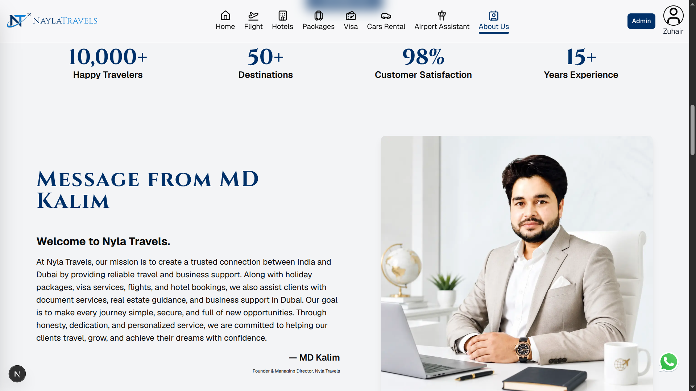

# ✈️ Nyla Travels

A modern full-stack travel booking platform built with **Next.js 16**, offering flight search, holiday packages, visa information, hotels, activities, and an admin dashboard.

> 🚧 This project is currently under active development.

---

## 📸 Preview

<!-- Add screenshots here -->

| Home | Flights |
|------|----------|
|  |  |

---

# ✨ Features

### 🌍 User Features

- Flight Search
- Holiday Packages
- Visa Information
- Hotels
- Activities
- Airport Services
- Responsive Design
- SEO Optimized
- Google Authentication
- User Dashboard

---

### 🔐 Admin Features

- Dashboard Analytics
- Manage Flights
- Manage Packages
- Manage Visas
- Manage Activities
- Manage Hotels
- Manage Airport Services
- Image Upload
- Search & Pagination
- CRUD Operations

---

# 🛠 Tech Stack

## Frontend

- Next.js 16 (App Router)
- React 19
- Tailwind CSS
- Shadcn UI
- Framer Motion

## Backend

- Next.js Server Actions
- Better Auth
- MongoDB
- Mongoose

## Authentication

- Better Auth
- Google OAuth

## Image Storage

- Cloudinary

## APIs

- SerpAPI (Google Flights)

---

# 📁 Project Structure

```
app/
components/
actions/
lib/
models/
hooks/
public/
middleware.js
```

---

# ⚙️ Installation

Clone the repository

```bash
git clone https://github.com/yourusername/nyla-travels.git
```

Go into the project

```bash
cd nyla-travels
```

Install dependencies

```bash
npm install
```

Create environment file

```env
NEXT_PUBLIC_BETTER_AUTH_URL=
BETTER_AUTH_SECRET=

MONGODB_URI=

NEXT_PUBLIC_GOOGLE_CLIENT_ID=
GOOGLE_CLIENT_SECRET=

SERP_API_KEY=

CLOUDINARY_CLOUD_NAME=
CLOUDINARY_API_KEY=
CLOUDINARY_API_SECRET=
```

Run development server

```bash
npm run dev
```

Open

```
http://localhost:3000
```

---

# 🚀 Roadmap

- [x] Flight Search
- [x] Holiday Packages
- [x] Visa Module
- [x] Hotel Module
- [x] Activities
- [x] Admin Dashboard
- [x] Google Authentication
- [ ] Flight Booking
- [ ] Payment Gateway
- [ ] Email Notifications
- [ ] Booking History
- [ ] Reviews & Ratings
- [ ] Multi-language Support

---

# 📷 Screenshots

Add screenshots of

- Home Page
- Packages
- Visa Page
- Hotel Page
- Admin Dashboard

---

# 🤝 Contributing

Contributions are welcome.

1. Fork the repository
2. Create a feature branch
3. Commit your changes
4. Push your branch
5. Open a Pull Request

---

# 📄 License

This project is licensed under the MIT License.

---

# 👨‍💻 Developer

**Zuhair Akhtar**

Full Stack Developer

---

⭐ If you like this project, don't forget to star the repository.